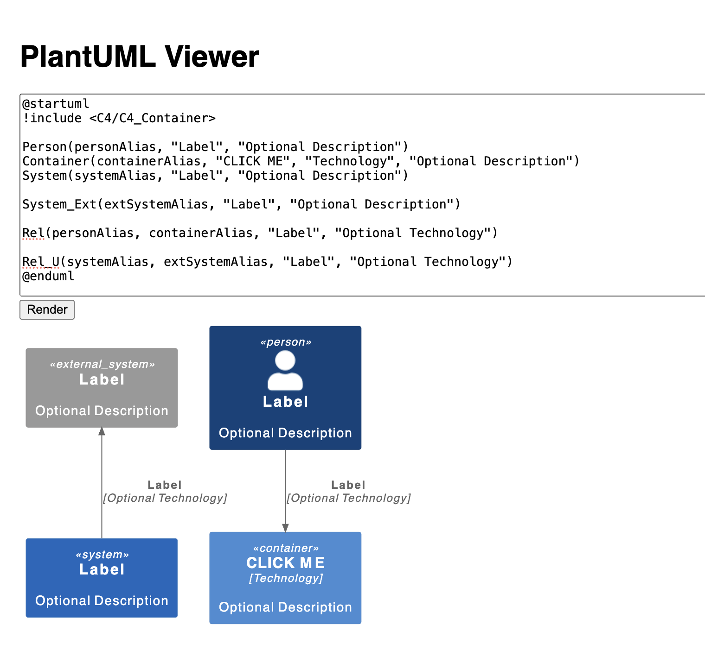

# PlantUML Viewer

Uses a docker container to render PlantUML files from a HTML page.



Run:

```bash
docker-compose down
docker-compose pull
docker-compose up -d
```

and:

```bash
npm start
```

Then open `http://localhost:3000` in your browser and start editing the plantuml content.

Also don't forget to click the "CLICK ME" container.
